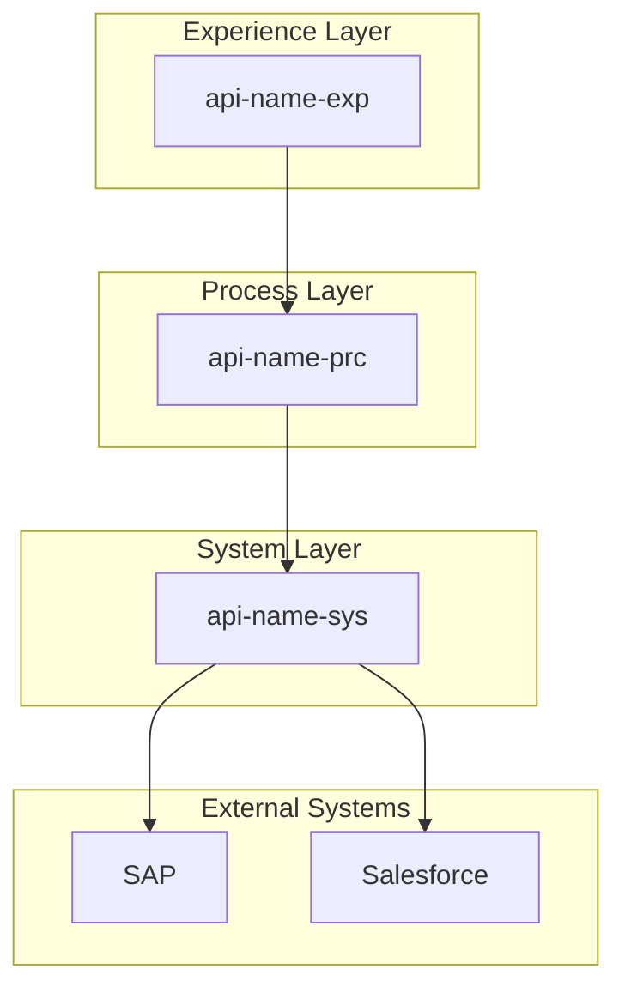
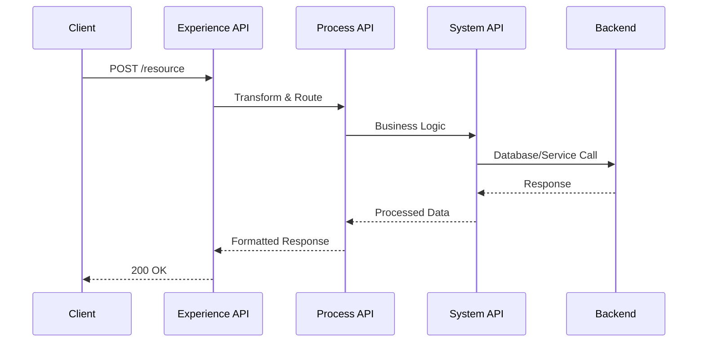
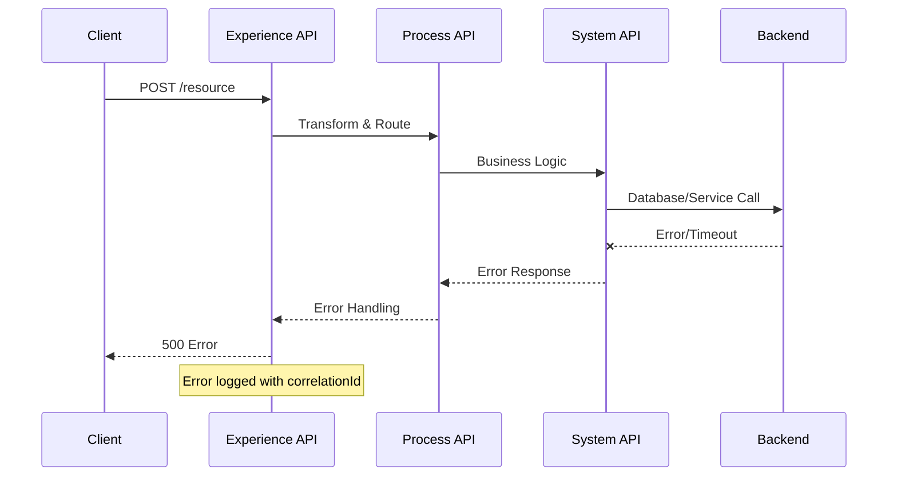
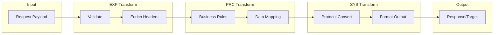
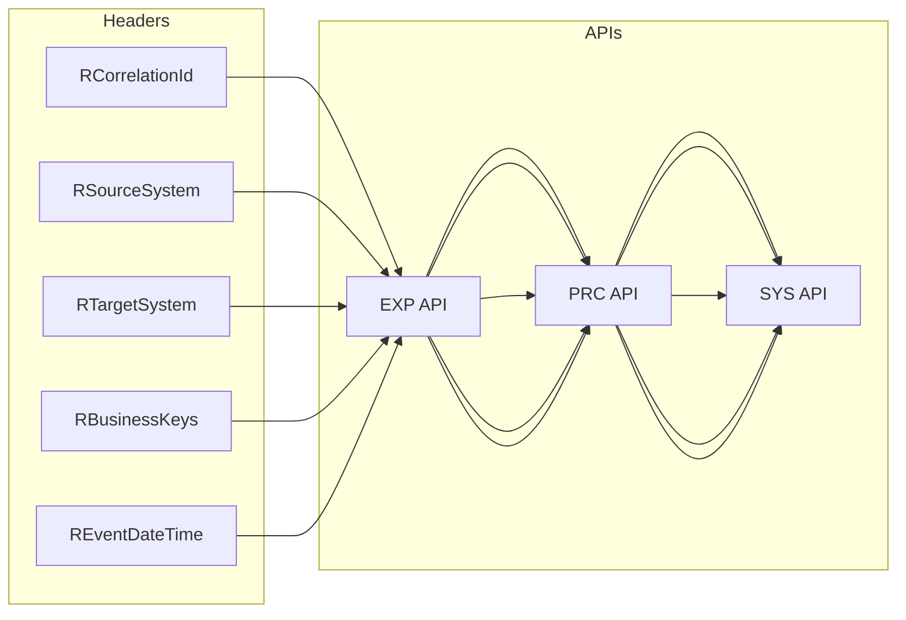
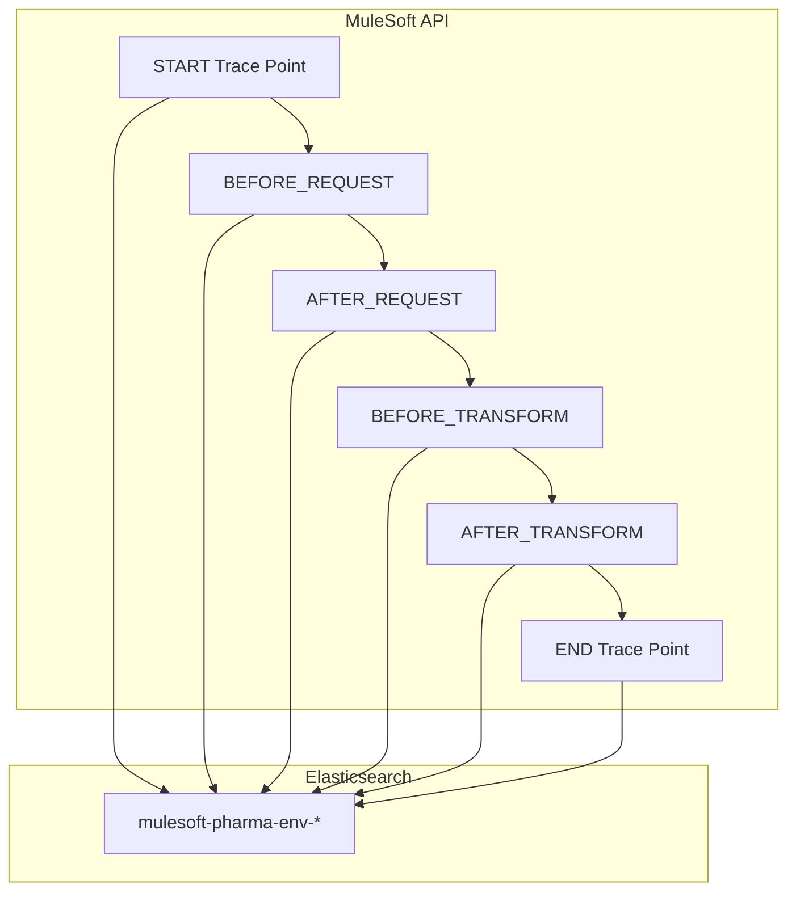
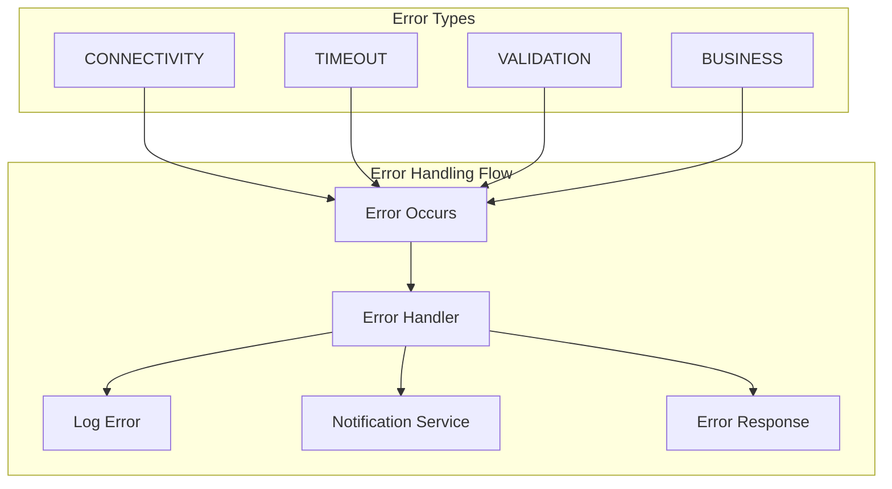
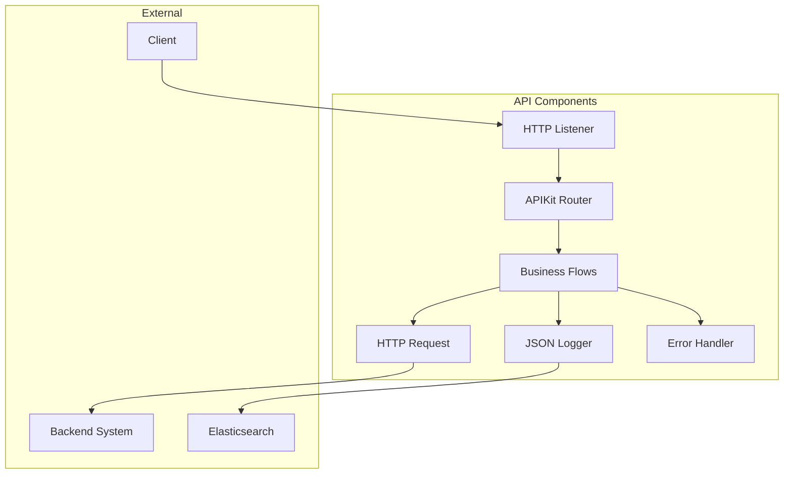
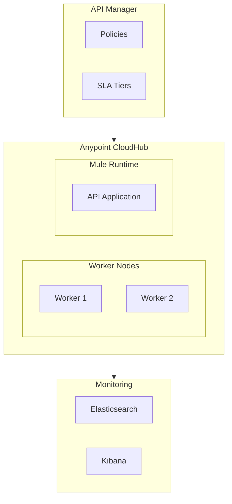

# Mermaid Diagram Templates Reference

All 10 diagram types for Step 5.

## 1. High-Level Architecture

## 2. Sequence Diagram (Success)

## 3. Sequence Diagram (Error)

## 4. Data Flow

## 5. Header Propagation

## 6. Logging Flow

## 7. Duration Tracking (Gantt)

```mermaid
gantt
    title API Transaction Duration
    dateFormat X
    axisFormat %L ms
    
    section EXP API
    Request Processing    :0, 50
    
    section PRC API
    Business Logic        :50, 150
    
    section SYS API
    Backend Call          :150, 400
    
    section Response
    Response Assembly     :400, 450
```

## 8. Error Handling

## 9. Component Diagram

## 10. Deployment Diagram

