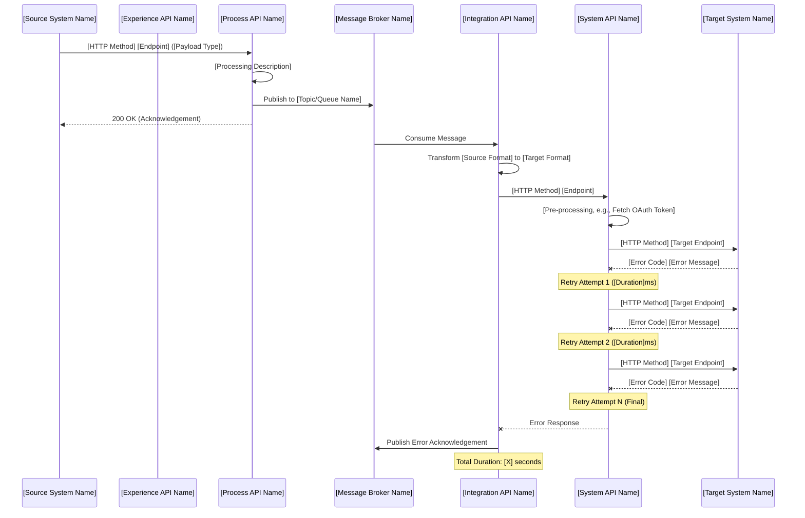
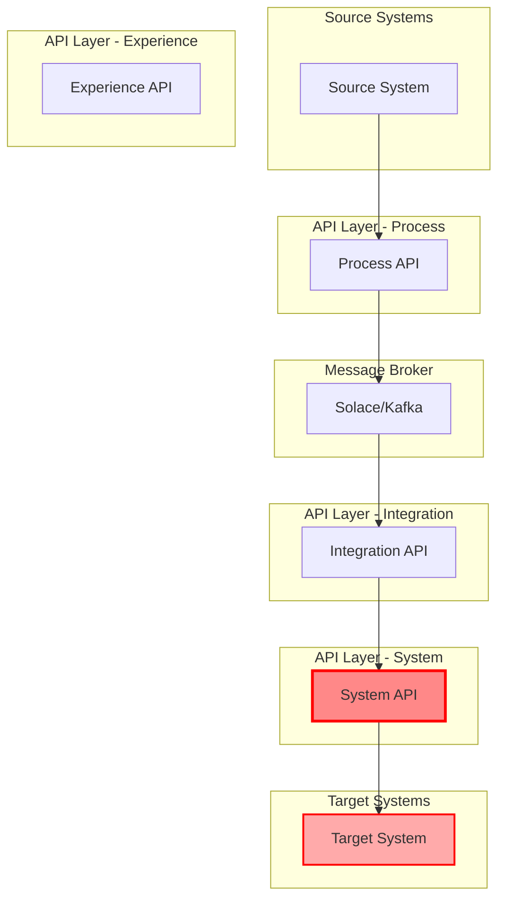
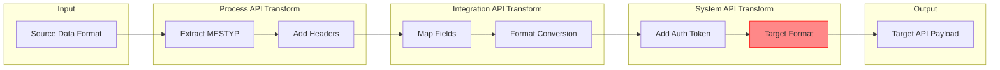
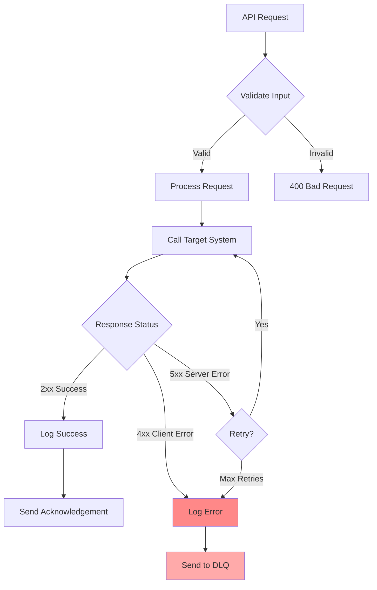

# HTML Incident Report Reference

Full specifications for Step 7: Generate HTML Incident Report.

## Prerequisite Check

Before generating, verify Step 0 (ELK query) is complete:
- Queried ELK with ±10 minute time range around the error timestamp
- Retrieved log entries (minimum 5, typical 50-200)
- Identified all APIs in the transaction chain
- Found all trace points (START, BEFORE_REQUEST, AFTER_REQUEST, EXCEPTION, END, retries)
- Calculated total duration from first to last timestamp

If Step 0 was skipped, STOP and go back to execute the ELK query.

## Report Specifications

- **Theme:** Professional light theme with red accents for errors
  - Background: `#ffffff`
  - Cards: `#f8f9fa`
  - Error accent: `#dc3545`
  - Success accent: `#28a745`
  - Warning accent: `#ffc107`
- **No external dependencies** - All CSS embedded
- **File output:** Save as `incident-report-{correlation_id}.html`

## REQUIRED Sections (ALL 12 must be present)

### 1. Executive Summary
- **Incident ID:** Correlation ID
- **Date/Time:** Error timestamp
- **Environment:** dev/test/stage/prod
- **Application:** API application name
- **Severity:** Critical/High/Medium/Low
- **Status:** Investigating/Identified/Resolved
- **Brief Description:** 2-3 sentence summary of the incident

### 2. Error Details Panel
- **Error Message:** Full error text
- **HTTP Status Code:** (if applicable)
- **Error Type:** Connectivity/Timeout/Validation/Business
- **Location:** Component, flow, file, line number
- **Elapsed Time:** Time spent before error
- **Retry Attempts:** Number of retries (if applicable)

### 3. Business Context
- **Business Keys:** Key-value pairs as colored tags
- **Source System:** Origin system name
- **Target System:** Destination system name
- **Data Classification:** C1/C2/C3/C4
- **Region:** Geographic region (if applicable)
- **Entity/Interface:** Business entity type

### 4. Metrics Dashboard (4 cards in a row)
- **Total Events:** Count of log entries analyzed
- **APIs Involved:** Number of unique APIs in the transaction
- **Total Duration:** First to last timestamp
- **Retry Count:** Number of retry attempts

### 5. Root Cause Analysis
- **Identified Cause:** Clear statement of root cause (1-2 sentences)
- **Error Category:** Configuration/Code/Integration/Infrastructure/Business Rule
- **Responsible Component:** Which API/system caused the issue
- **Evidence:** Supporting log entries or analysis
- **Technical Details:** Deeper technical explanation (3-5 bullet points)

### 6. API Flow Diagram (HTML Visual + Mermaid Code)

**MANDATORY COMPONENTS - ALL must be present:**

The API flow diagram MUST show the complete transaction chain with ALL of these layers (even if some are inferred):

1. **Source System** (leftmost) - The originating system (e.g., S4hana, Salesforce, External API)
2. **Experience API** (if applicable) - Entry point for API consumers
3. **Process API** - Orchestration layer that receives from source/experience API
4. **Message Broker** (if applicable) - Solace, Kafka, ActiveMQ, etc.
5. **Integration API** (if applicable) - Transformation and routing layer
6. **System API** - API that directly calls the target system
7. **Target System** (rightmost) - The destination system (e.g., Salesforce, SAP, Database)

**Required Visual Elements (HTML):**

```html
<div class="flow-diagram">
    <div class="flow-container">
        <!-- Source System -->
        <div class="flow-node source">
            <div class="flow-node-icon">[ICON]</div>
            <div class="flow-node-name">[System Name]</div>
            <div class="flow-node-type">Source System</div>
        </div>
        <div class="flow-arrow">--></div>

        <!-- Process API (if found in logs) -->
        <div class="flow-node integration">
            <div class="flow-node-icon">API</div>
            <div class="flow-node-name">[API Name]</div>
            <div class="flow-node-type">Process API</div>
            <div class="status-tag status-success">SUCCESS</div>
        </div>
        <div class="flow-arrow">--></div>

        <!-- Message Broker (if found in logs) -->
        <div class="flow-node integration">
            <div class="flow-node-icon">MQ</div>
            <div class="flow-node-name">Solace/Kafka</div>
            <div class="flow-node-type">Message Queue</div>
            <div class="status-tag status-success">SUCCESS</div>
        </div>
        <div class="flow-arrow">--></div>

        <!-- Integration API (if found in logs) -->
        <div class="flow-node integration">
            <div class="flow-node-icon">API</div>
            <div class="flow-node-name">[API Name]</div>
            <div class="flow-node-type">Integration API</div>
            <div class="status-tag status-error">ERROR</div>
        </div>
        <div class="flow-arrow error">--X</div>

        <!-- System API -->
        <div class="flow-node integration error">
            <div class="flow-node-icon">API</div>
            <div class="flow-node-name">[API Name]</div>
            <div class="flow-node-type">System API</div>
            <div class="status-tag status-error">400 ERROR</div>
        </div>
        <div class="flow-arrow error">--X</div>

        <!-- Target System -->
        <div class="flow-node target error">
            <div class="flow-node-icon">[ICON]</div>
            <div class="flow-node-name">[System Name]</div>
            <div class="flow-node-type">Target System</div>
            <div class="status-tag status-error">REJECTED</div>
        </div>
    </div>
</div>
```

**Color/Style Rules:**
- **Green border + SUCCESS badge** = Component processed successfully
- **Red border + error background + ERROR badge** = Component where error occurred
- **Red arrow (--X)** = Failed connection
- **Gray arrow (-->)** = Successful connection

**Required Mermaid Sequence Diagram Code (Add AFTER the HTML visual):**



**Rules for Diagram Consistency:**
- If a component is not found in the logs, mark it as "N/A" but STILL include the box/node
- At minimum, you MUST show: Source System → At least 1 API → Target System
- The failing component must have red border and error background
- Always include retry attempts in the sequence diagram if retries occurred
- Show the complete message flow including acknowledgements

### 6b. Additional Mermaid Diagrams (Optional but Recommended)

**System Architecture Diagram:**


**Data Flow Diagram:**


**Error Handling Flow Diagram:**


### 7. Transaction Timeline (Detailed)
- **Table columns:**
  - Timestamp (HH:MM:SS.mmm)
  - Application Name
  - Flow/Component
  - Trace Point
  - Message/Description
  - Elapsed Time (ms)
  - Status Icon (checkmark success, X error, warning triangle)
- **Color coding:**
  - START = green background
  - ERROR/EXCEPTION = red background
  - END = cyan background
  - Other trace points = light gray background
- **Sort:** Chronological order (oldest first)

### 8. Impact Assessment
- **Business Impact:** Description of business consequences
- **Affected Systems:** List of impacted systems
- **Affected Transactions:** Count or business keys
- **Customer Impact:** Yes/No with explanation
- **Data Loss Risk:** Yes/No with explanation

### 9. Resolution Steps (Numbered List)
- **Immediate Actions:** 3-5 steps to resolve the issue now
- **Verification Steps:** How to confirm the fix worked
- **Example:**
  ```
  1. Contact Salesforce FMI team to enable DE country in configuration
  2. Verify DE is in allowed countries list for endpoint
  3. Reprocess failed transaction from Solace DLQ
  4. Monitor ELK logs for successful END trace point
  5. Verify pricing data synced to Salesforce
  ```

### 10. Recommendations to Prevent Recurrence
- **Table format:**
  - Priority (HIGH/MEDIUM/LOW) - color-coded badges
  - Recommendation - Clear actionable item
  - Owner/Team - Who should implement
- **Minimum 3 recommendations, maximum 7**
- **Example:**

| Priority | Recommendation | Owner |
|----------|----------------|-------|
| HIGH | Add pre-validation for country eligibility | Integration Team |
| MEDIUM | Implement smart retry logic (skip 400 errors) | Platform Team |
| LOW | Document enabled countries and update process | Ops Team |

### 11. Additional Resources
- **ELK/Kibana Query:** KQL query to reproduce the search
- **Related Logs:** Links or queries for related errors
- **Documentation:** Links to API documentation, runbooks, or SOPs
- **Contact Information:** Support team email (e.g., gis_it.mulesoft_operations@roche.com)

### 12. Appendix (Collapsible)
- **Full Error Log JSON:** Formatted JSON in a code block
- **Configuration Details:** Relevant config from properties files
- **Related Errors:** Other similar errors in the timeframe (if found)

## HTML Styling Requirements

- Use Bootstrap-like card layouts
- Responsive design (mobile-friendly)
- Sections should be clearly separated with headers
- Use badges for status, severity, priority
- Use icons for success/error/warning states (Unicode or embedded SVG)
- Print-friendly CSS (hide navigation, optimize for A4)

## Consistency Rule

All 12 sections MUST be present in every incident report. If data is unavailable for a section, show "N/A" or "Not Available" rather than omitting the section.

## Documentation Consistency Rule (MANDATORY)

**ALL endpoints must have equally detailed documentation.** Do NOT create abbreviated descriptions for some endpoints while providing detailed descriptions for others.

### Requirements for Every Request Description:

1. **Start with a descriptive header**: `## {HTTP Method} {Resource/Action} - {Entity/Type}`
2. **Brief description**: 1-2 sentences explaining what the endpoint does
3. **Request Body section** (for POST/PUT/PATCH):
   ```markdown
   ### Request Body
   XML/JSON payload containing {description}
   ```
4. **Headers table** (if custom headers are used):

| Header | Required | Description |
|--------|----------|-------------|
| RCorrelationId | Optional | Unique correlation ID for tracing |
| RSourceSystem | Optional | Source system identifier |
| RTargetSystem | Optional | Target system identifier |
| RBusinessKeys | Optional | Business keys for the transaction |

5. **Response codes table** (for ALL endpoints):

| Code | Description |
|------|-------------|
| 200 | Transaction processed successfully |
| 400 | Bad Request - Invalid payload |
| 401 | Unauthorized |
| 500 | Internal Server Error |

**Validation:**
- Review all generated request descriptions before finalizing
- Ensure the first endpoint is NOT more detailed than the others
- Maintain consistent formatting and structure across all endpoints
- If one endpoint has a headers table and response codes, ALL similar endpoints must have them
